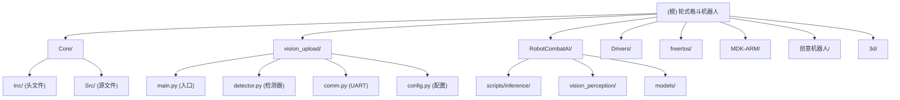

# CLAUDE.md

This file provides guidance to Claude Code (claude.ai/code) when working with code in this repository.

## 多 AI 协作模式

本项目接入 **Claude Code / Codex CLI / Gemini CLI** 三方协作体系（Claude 强主导）：

- Claude Code = 总指挥（编排 / 文件操作 / MCP 调度）
- Codex CLI   = 评审官（深推理 / second opinion / 沙箱执行）
- Gemini CLI  = 情报官（长文档 / 多模态 / Web 检索）

**全局宪法**：[`~/.ai-collab/rules.md`](file://~/.ai-collab/rules.md) — 三方共同遵守
**项目共享区**：[`./.ai-shared/`](./.ai-shared/) — 当前任务上下文与产物交接（`context.md` / `decisions.md` / `handoff/`）
**召唤方式**：
- `Agent({subagent_type: "codex-reviewer", ...})` 或 `/co-review <file>`
- `Agent({subagent_type: "gemini-researcher", ...})` 或 `/co-research <topic>`

@~/.ai-collab/rules.md

## 变更记录 (Changelog)

| 时间 | 变更 |
|------|------|
| 2026-04-08 02:18 | 架构师扫描 v2: 新增模块结构图, 新增 vision_upload/ 模块文档, 更新状态机描述与通信协议, 生成 Core/CLAUDE.md + vision_upload/CLAUDE.md + RobotCombatAI/CLAUDE.md, 更新 .claude/index.json |

## 项目概述

2025中国高校智能机器人创意大赛——轮式机器人格斗A。三合一仓库：**嵌入式控制固件**（STM32F407 + FreeRTOS）、**AI视觉感知**（Radxa Cubie A7Z + VIP9000 NPU）、**机械设计**（SolidWorks + 制造文件）。

**竞赛约束**: 机器人<=4KG，出发区<=30x30cm，2分钟/场，擂台2.4m x 2.4m x 6cm高，AprilTag能量块计分。

## 系统架构

```
+--------------------------------------------+
|   Radxa Cubie A7Z (上位机/视觉处理)         |
|   全志A733 SoC, 2xA76+6xA55               |
|   VeriSilicon VIP9000 NPU (3TOPS@INT8)     |
|   HSV颜色检测 + YOLOv5(可选), Debian Linux |
+---------------------+----------------------+
                      | UART 115200bps (USART2: PD5-TX, PD6-RX)
+---------------------+----------------------+
|   STM32F407VET6 (下位机/实时控制)           |
|   168MHz, 512KB Flash, FreeRTOS            |
|   电机开环控制 + 传感器融合 + 状态机        |
+--------------------------------------------+
```

**上位机远程访问**: `ssh radxa@192.168.22.215`（密码: radxa, IP 为 DHCP 动态分配）

## 模块结构图



## 模块索引

| 模块 | 语言 | 入口 | 职责 |
|------|------|------|------|
| [Core/](Core/CLAUDE.md) | C | `Core/Src/main.c` | STM32 实时控制: 状态机、电机驱动、传感器融合、UART通信 |
| [vision_upload/](vision_upload/CLAUDE.md) | Python | `vision_upload/main.py` | **实际部署**的视觉系统 v6: HSV颜色检测、Tag辅助、MJPEG流 |
| [RobotCombatAI/](RobotCombatAI/CLAUDE.md) | Python | `scripts/inference/realtime_vision.py` | NPU推理管线: YOLOv5 + VIPLite/RKNN/ACL多后端 |
| Drivers/ | C | -- | STM32 HAL驱动 + CMSIS (CubeMX生成, **勿手动修改**) |
| freertos/ | C | -- | FreeRTOS内核源码 (**勿手动修改**) |
| MDK-ARM/ | -- | `robot.uvprojx` | Keil uVision工程文件 |
| 创意机器人/ | SolidWorks | -- | 机械设计 (二进制CAD文件) |
| 3d/ | 3MF | -- | 3D打印文件 (上车板.3MF, 下车板.3MF) |

## 项目结构

```
根目录/
+-- Core/                   # STM32 用户代码 (主要开发区)
|   +-- Inc/                # 头文件 (robot_control.h, vision_parser.h, motor.h 等)
|   +-- Src/                # 源文件 (robot_control.c, robot_fight.c, vision_parser.c 等)
+-- vision_upload/          # 视觉系统 v6 (实际部署, Python)
|   +-- main.py             # 主入口 + VisionSystem + MJPEG服务器
|   +-- detector.py         # ColorDetector + Tracker + TagDetector
|   +-- comm.py             # UartComm (UART通信)
|   +-- config.py           # 统一配置 (相机/HSV/UART)
|   +-- stream.py           # 独立流媒体调试服务器
|   +-- calibrate.py        # HSV标定工具
|   +-- vision.service      # systemd服务配置
+-- RobotCombatAI/          # AI视觉感知子系统 (NPU推理管线)
|   +-- scripts/inference/  # 推理入口 (realtime_vision.py)
|   +-- vision_perception/  # 检测器 (viplite_detector.py, target_selector.py, uart_comm.py)
|   +-- models/             # 模型文件 (.nb/.om/.onnx)
+-- Drivers/                # STM32 HAL驱动 + CMSIS (CubeMX生成, 勿修改)
+-- freertos/               # FreeRTOS内核源码
+-- MDK-ARM/                # Keil uVision工程文件
|   +-- robot.uvprojx       # 主工程文件
+-- robot.ioc               # STM32CubeMX配置 (引脚/时钟/外设定义源)
+-- 创意机器人/              # SolidWorks机械设计
+-- 3d/                     # 3D打印文件 (.3MF)
+-- 总框架.md                # 完整系统架构设计文档
+-- FreeRTOS框架设计.md      # RTOS任务设计文档
+-- 方案总结.md              # 竞赛规则 + 备赛方案 + 采购清单
+-- Cubie_A7Z_NPU适配指南.md # NPU环境搭建 + 模型转换指南
+-- 视觉完赛方案.md          # 视觉系统整体方案
```

## 运行与开发

### 嵌入式固件 (Core/)

- **IDE**: Keil MDK-ARM V5.32 (ARM Compiler)
- **工程文件**: `MDK-ARM/robot.uvprojx`
- **CubeMX配置**: `robot.ioc` (修改引脚/外设后重新生成代码)
- **构建输出**: `MDK-ARM/build/robot.hex`
- **烧录**: Keil + ST-Link 调试器

### 视觉系统 (vision_upload/)

```bash
# SSH 到上位机
ssh radxa@192.168.22.215  # 密码: radxa

# 部署文件
scp -r vision_upload/ radxa@192.168.22.215:~/

# 启动服务
sudo systemctl start vision.service

# 查看日志
tail -f /tmp/vision_det.log

# 查看流媒体
# 浏览器打开 http://192.168.22.215:8080
```

### MCU硬件资源映射

| 外设 | 用途 | 引脚/配置 |
|------|------|-----------|
| TIM4 CH1-CH4 | 电机PWM输出 (~20kHz) | PD12-PD15, ARR=4199 |
| TIM1/3/5/8 | 编码器模式 (4路) | PE9/11, PA6/7, PA0/1, PC6/7 |
| ADC2 + DMA2_S2 | 灰度传感器x2 (边缘检测) | PC0, PC1 |
| USART2 + DMA1 | 与Cubie A7Z通信 | PD5(TX), PD6(RX), 115200bps |
| I2C1 | OLED显示 | PB6(SCL), PB7(SDA) |
| I2C2 | MPU-6050 IMU | PB10(SCL), PB11(SDA) |
| GPIO (PE0-4,12-14) | 红外传感器x10 | 数字输入 |
| TIM7 | HAL系统节拍 | 1ms tick |

### 通信协议 (UART, 115200bps)

**上位机 -> STM32** (视觉数据):
```
$type,cx,cy,area,dir*CS\n
  type: E=敌方 N=中立 F=友方 X=无目标 B=炸弹
  cx,cy: 目标中心坐标 [0-640, 0-480]
  area: 面积(像素)   dir: 方向 [-100,+100]
  CS: body XOR校验和(十六进制2位)
  例: $E,320,240,5000,+25*4A\n
```

**STM32 -> 上位机** (指令):
```
单字节: 'b'=蓝方 'y'=黄方 's'=开始 'p'=暂停 'c'=收集模式 'f'=战斗模式
```

## 状态机架构

### 顶层状态机 (robot_control.c, 10ms周期)

```
ROBOT_GO_UP  --(完成)--> ROBOT_ROAMING --(视觉/红外检测到目标)--> ROBOT_ATTACK
     ^                        ^                                       |
     |                        |                             (完成/目标丢失)
     |                        +---------------------------------------+
     |                        |
     |                   (灰度掉台)
     |                        v
     +------------------ ROBOT_BACKUP --(回台完成)--> ROBOT_ROAMING
```

### 安全机制

| 机制 | 传感器 | 阈值 | 说明 |
|------|--------|------|------|
| 灰度掉台(正常) | ADC2 x2 | 滤波值 > 2.85V, 连续5次 | 50ms 确认延迟 |
| 灰度掉台(紧急) | ADC2 x2 | 原始值 > 3.10V, 双传感器 | 零延迟确认 |
| 红外边缘 | IR1/IR2 | 数字触发 | 20ms消抖 -> 后退+转向 |
| 视觉类型消抖 | UART | 连续2帧相同 | 防止E/F闪烁 |

## 测试策略

- **嵌入式 (C)**: 无自动化测试, 通过 Keil 仿真器 + OLED + 串口调试
- **视觉 (Python)**: 无自动化测试, 通过 MJPEG 流 + 检测日志 + calibrate.py 验证
- **集成测试**: 实际硬件联调 (STM32 + 上位机 + 电机 + 传感器)

## 编码规范

### 嵌入式 (C)

- `Drivers/` 和 `freertos/` 由CubeMX/官方源码提供，**不要手动修改**
- 用户代码写在 `Core/Src/` 和 `Core/Inc/`，CubeMX重新生成时保留 `USER CODE BEGIN/END` 区块
- 修改外设配置通过 `robot.ioc` -> CubeMX重新生成
- 中断优先级：控制循环(5) > DMA传感器(5-6) > UART通信(7) > 系统节拍(15)
- 状态机模式: 每个子系统提供 `*_Init()` + `*_Update()` + `*_IsDone()` 三元接口

### AI视觉 (Python)

- **禁止安装 RKNN**: Cubie A7Z 使用全志 A733 + VeriSilicon NPU，不是瑞芯微方案
- 板端推理使用 VIPLite C API (ai-sdk)，模型格式为 `.nb`
- 环境变量 `LD_LIBRARY_PATH` 必须包含 `ai-sdk/viplite-tina/lib/aarch64-none-linux-gnu/v2.0/`
- 模型转换在 x86 PC 上通过 ACUITY Toolkit Docker 容器完成 (A733 使用 v2.0.10 镜像)
- `target_selector.py` 和 `uart_comm.py` 为纯 Python 模块，可跨平台复用
- 所有相机参数统一由 `config.setup_camera()` 设置，不在检测器中重复配置
- HSV 阈值通过 `calibrate.py` 标定, 支持 `hsv_calibration.json` 自动加载

## AI 使用指引

### 修改固件代码时

1. 只修改 `Core/Src/` 和 `Core/Inc/` 中的文件
2. 不要修改 `Drivers/`、`freertos/`、CubeMX 生成的初始化代码
3. 注意 `USER CODE BEGIN/END` 注释标记
4. 状态机新增状态需同步更新对应的 `.h` 枚举定义
5. UART 协议修改需同步更新 `vision_parser.c` 和 `vision_upload/comm.py`

### 修改视觉代码时

1. 首选修改 `vision_upload/` (实际部署版本)
2. HSV 阈值调整修改 `config.py`，不要硬编码在 `detector.py` 中
3. UART 协议修改需同步更新 `comm.py` 和 `Core/Src/vision_parser.c`
4. 新增环境变量在 `config.py` 顶部定义，使用 `os.environ.get()` 模式
5. 测试时使用 `--no-uart` 避免串口依赖

### 关键文件速查

| 需求 | 文件 |
|------|------|
| 修改比赛策略逻辑 | `Core/Src/robot_control.c`, `robot_fight.c`, `robot_roaming.c` |
| 调整电机速度 | `Core/Inc/motor.h` (速度宏定义) |
| 修改状态机时间参数 | `Core/Inc/robot_fight.h`, `robot_roaming.h`, `robot_up.h` |
| 调整 HSV 检测阈值 | `vision_upload/config.py` |
| 修改 UART 协议 | `Core/Src/vision_parser.c` + `vision_upload/comm.py` |
| 调整视觉跟踪行为 | `vision_upload/detector.py` (Tracker 类) |
| 修改传感器引脚 | `robot.ioc` -> CubeMX 重新生成 |

## 已知问题

- FreeRTOS 任务架构尚未完全实现，控制逻辑运行在主循环轮询中
- PID 闭环控制器已实现但未启用，当前使用开环速度档位
- 编码器数据已采集但未用于速度反馈
- `RobotCombatAI/` 中 RKNN/ACL 旧代码未清理
- 上位机 IP 为 DHCP 动态分配，可能变化

## NPU 技术栈 (参考)

| 项目 | 说明 |
|------|------|
| NPU 芯片 | VeriSilicon VIP9000 (3 TOPS@INT8) |
| 驱动节点 | `/dev/vipcore` |
| 模型格式 | `.nb` (NBG - Network Binary Graph) |
| 转换工具 | ACUITY Toolkit (x86 Docker, v2.0.10) |
| 推理运行时 | VIPLite C API (awnn) -- 无官方 Python API |
| SDK 仓库 | `github.com/ZIFENG278/ai-sdk.git` |

详细环境搭建与模型转换流程参见 `Cubie_A7Z_NPU适配指南.md`。
